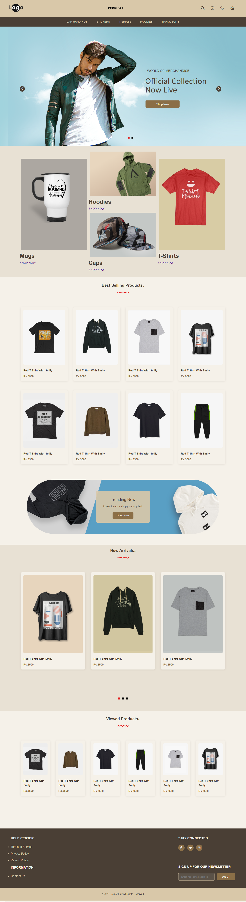

<div align="center">
  
  
  
  
  [](https://twitter.com/intent/follow?screen_name=Qaisersidd)
 
  <br />

  <h2 align="center">Modern Merchandise Store Website</h2>

  A fully responsive merchandise store website with modern UI/UX design, built using HTML5 & CSS3. Features include product galleries, trending items section, and a newsletters subscription.


  <a href="https://QaiserEjaz.github.io/merchandise-store/"><strong>➥ Live Demo</strong></a>

</div>

### Demo Screeshots



### Prerequisites

Before you begin, ensure you have met the following requirements:

* [Git](https://git-scm.com/downloads "Download Git") must be installed on your operating system.

### Run Locally

To run **merchandise-store** locally, run this command on your git bash:

Linux and macOS:

```bash
sudo git clone https://github.com/QaiserEjaz/merchandise-store.git
```

Windows:

```bash
git clone https://github.com/QaiserEjaz/merchandise-store.git
```

### Contact

If you want to contact me you can reach me at [Twitter](https://www.twitter.com/QaiserSidd).

### License

This project is **free to use** and does not contains any license.

### 🙏 Acknowledgments
- Font Awesome for icons
- Google Fonts for typography
- Unsplash for stock images